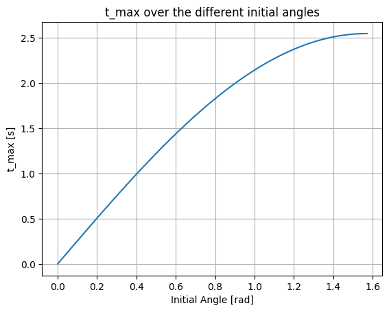

# Oblique_launch
In this post, we are going to discuss about the oblique launch in classical mechanics using Python to observe the features that can be extracted and learn how to analyze this kind of physical system.

First of all, before any kind of mathematical interpretation, we need to understand what kind of physics we're dealing with, in order to elaborate our scientific discussion, and get into a response. The oblique launch begins with an object, which can be considered as a particle for pratical purposes, being launched with an angle $\theta$ relative to the ground. This particle is accelerated, having an initial velocity vector $\vec{v_{0}}$, which can be decomposed into two components $\vec{v_{0x}}$ and $\vec{v_{0y}}$ (for 2D motion). These two velocities works in two different ways, so this motion suggests two independent movements, in which creates the 2D oblique launch. The velocity in the $x$ axis is constant, which means that does not depend on time once the particle was launched. On the other hand, the velocity in the $y$ axis depends on time, and it has an influence of the gravitational potential of the Earth, adding up an acceleration term $\vec{g}$.

- **X Component**:
  $$\vec{v_{0x}} = v_{0} \cos \theta$$

- **Y Component**:
  $$\vec{v_{0y}} = v_{0} \sin \theta - \vec{g} t$$
  
From that, we can start to extract some features from the given system with Python. In this case, we're going to use the libraries: Matplotlib, Numpy and Sympy.

```markdown
```python
import numpy as np
import matplotlib.pyplot as plt
import sympy
```
In this way, using the function Integrate of Sympy, we can extract the positions of the particle in this system, in order to evaluate how the particle moves in both axis. This trick comes from the fact that velocity is a variation of the position in time, where once we integrate the derivative $\frac{dx}{dt}$, we can return the velocity to the position in the given axis.

$$\int_{0}^{x} \frac{dx}{dt}dt = \int_{0}^{x} v_{x} dt = x$$

```markdown
```python
#Declaring the variables and given initial velocities of the system 

v_0x, v_0y, v_0, theta, g ,t = sympy.symbols('v_0x v_0y v_0 theta g t')

v_0x = v_0 * sympy.cos(theta)
v_0y = v_0 * sympy.sin(theta) - g*t

#Integrating the velocities to get the position in both axis x and y 
x = sympy.integrate(v_0x, t)
y = sympy.integrate(v_0y, t)
```

After integrating both velocities, we get: 

- **X position:**
$x = v_{0}\cos\theta$

- **Y position:**
$y = v_{0}\sin\theta t - \frac{1}{2}gt^{2}$

Through these steps, we were able to get sufficient information about the physical system in question, which are the coordinates in both axis $(x,y)$ and both velocities $(\vec{v_{x}}, \vec{v_{y}})$. Then, let's suppose we want to find the max altitude $y_{max}$. For this, we need to do some assumptions: when $y \rightarrow y_{max}$, the velocity $v_{y} \rightarrow 0$, which means that in the max altitude the particle still at rest. From this, we can find the time that gets to the particle reach the max altitude $y_{max}$. 

$$0 = v_{0}\sin\theta - gt$$

$$gt = v_{0}\sin\theta$$

$$t = t_{max} = \frac{v_{0} \sin\theta}{g}$$

Let's vary the angle $\theta$ and see how this affects the time $t_{max}$... 

```markdown
```python
#Supposing values

v_0 = 25 #m/s
g = 9.81 #m/s^2

theta = np.linspace(0,90, 50)
theta_rad = np.radians(theta)

#Converting degrees to radians, because numpy can only read angle values in radians

t = v_0 * np.sin(theta_rad)/g

plt.plot(theta_rad, t)
plt.xlabel('Initial Angle [rad]')
plt.ylabel('t_max [s]')
plt.title('t_max over the different initial angles')
plt.grid(True)
plt.show()
```


Now, after obtaining the value of $t_{max}$, we can find out the expression that calculate $y_{max}$, considering that we have already found how to calculate the coordinate $y$. In this way, we replace the $t_{max}$ obtained in the follow expression: 


$$y_{max} = v_{0}\sin\theta t_{max} - \frac{1}{2}gt_{max}^{2}$$

$$y_{max} = v_{0}\sin\theta (\frac{v_{0}\sin\theta }{g}) - \frac{1}{2}g(\frac{v_{0}\sin\theta}{g})^{2}$$

$$y_{max} = (\frac{(v_{0}\sin\theta)^2}{g}) - \frac{1}{2}g(\frac{1}{g^{2}})(v_{0}\sin\theta)^2$$

$$y_{max} = \frac{(v_{0}\sin\theta )^2}{2g}$$
